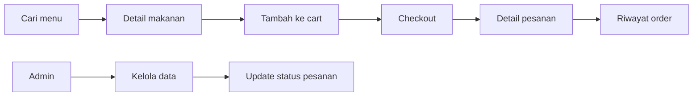

<p align="center">
  
</p>

<h1 align="center">CARIMAKAN</h1>

<p align="center">
  Web pemesanan makanan lokal bergaya retro dengan katalog menu, cart, checkout, riwayat pesanan, favorit, review, dan admin panel.
</p>

<p align="center">
  
  
  
  
  
</p>

---

## Overview

CARIMAKAN adalah aplikasi full-stack food ordering. Frontend dibuat dengan React + Vite, backend memakai Express + Prisma, dan database menggunakan MySQL/MariaDB.

Fokus project ini adalah membuat pengalaman pencarian makanan terasa cepat dan jelas: user bisa melihat menu, memasukkan item ke keranjang, checkout, lalu memantau riwayat pesanan. Admin dapat mengelola menu, kategori, restoran, pesanan, dan user dari dashboard.

## Fitur

| Modul | Fitur |
| --- | --- |
| Menu | katalog, pencarian, kategori, rekomendasi, detail menu |
| User | register, login, profil, favorit, review, rating |
| Cart | tambah item, ubah jumlah, hapus item, clear cart |
| Checkout | buat pesanan, halaman detail pesanan, riwayat order |
| Admin | dashboard, menu, kategori, restoran, pesanan, user |
| Backend | Prisma ORM, JWT auth, Zod validation, upload gambar |
| Safety | error boundary frontend, rate limit auth/admin, smoke test |

## Alur Aplikasi



## Tech Stack

| Layer | Teknologi |
| --- | --- |
| Frontend | React 19, Vite, React Router, Axios, React Icons, React Hot Toast |
| Styling | Tailwind CSS 4, GSAP, Lenis, custom retro components |
| Backend | Node.js, Express 5, Prisma Client |
| Database | MySQL atau MariaDB |
| Auth & Security | JWT, Bcrypt, Helmet, CORS, rate limit |
| Validation & Upload | Zod, Multer |

## Struktur Folder

```text
CARIMAKAN/
|-- backend/
|   |-- prisma/
|   |-- scripts/
|   |-- src/
|   |   |-- config/
|   |   |-- controllers/
|   |   |-- middlewares/
|   |   |-- routes/
|   |   |-- services/
|   |   `-- server.js
|   `-- test-smoke.js
|-- frontend/
|   |-- public/
|   `-- src/
|       |-- components/
|       |-- context/
|       |-- pages/
|       |-- providers/
|       `-- services/
|-- docs/
|   `-- carimakan-banner.png
`-- README.md
```

## Quick Start

### 1. Clone

```bash
git clone https://github.com/tegokkk/CARIMAKAN.git
cd CARIMAKAN
```

### 2. Buat Database

```sql
CREATE DATABASE carimakan_db;
```

### 3. Jalankan Backend

```bash
cd backend
npm install
cp .env.example .env
npm run prisma:generate
npm run prisma:migrate
npm run seed
npm run seed:users
npm run dev
```

Backend berjalan di:

```text
http://localhost:5000
```

### 4. Jalankan Frontend

Buka terminal baru:

```bash
cd frontend
npm install
```

Buat file `.env`:

```env
VITE_API_URL=http://localhost:5000/api
```

Jalankan aplikasi:

```bash
npm run dev
```

Frontend berjalan di:

```text
http://localhost:5173
```

## Environment Backend

Contoh konfigurasi ada di `backend/.env.example`.

```env
PORT=5000
NODE_ENV=development

DB_HOST=localhost
DB_USER=root
DB_PASSWORD=
DB_NAME=carimakan_db
DB_PORT=3306
DATABASE_URL="mysql://root:@localhost:3306/carimakan_db"

JWT_SECRET=carimakan_secret_key
JWT_EXPIRES_IN=7d

CLIENT_URL=http://localhost:5173
UPLOAD_PATH=uploads
```

## Akun Development

Jalankan `npm run seed:users` untuk membuat akun default.

| Role | Email | Password |
| --- | --- | --- |
| Admin | `admin@carimakan.test` | `admin123` |
| User | `user@carimakan.test` | `user123` |

Untuk production, ganti password default dan gunakan `JWT_SECRET` yang kuat.

## Script

### Backend

| Command | Fungsi |
| --- | --- |
| `npm run dev` | menjalankan backend |
| `npm start` | menjalankan backend |
| `npm run prisma:generate` | generate Prisma Client |
| `npm run prisma:migrate` | menjalankan migration development |
| `npm run prisma:deploy` | menjalankan migration production |
| `npm run prisma:studio` | membuka Prisma Studio |
| `npm run seed` | seed data menu |
| `npm run seed:users` | seed user admin dan user biasa |
| `npm test` | menjalankan smoke test |

### Frontend

| Command | Fungsi |
| --- | --- |
| `npm run dev` | menjalankan Vite dev server |
| `npm run build` | build frontend |
| `npm run preview` | preview hasil build |
| `npm run lint` | menjalankan ESLint |

## API Ringkas

Base URL:

```text
http://localhost:5000/api
```

| Modul | Endpoint |
| --- | --- |
| Auth | `/auth/register`, `/auth/login`, `/auth/me`, `/auth/logout` |
| Category | `/categories` |
| Restaurant | `/restaurants` |
| Menu | `/menus`, `/menus/:id`, `/menus/recommended`, `/menus/stats` |
| Cart | `/cart` |
| Order | `/orders`, `/orders/my`, `/orders/:id` |
| Favorite | `/favorites`, `/favorites/:menuId` |
| Review | `/menus/:menuId/reviews`, `/reviews/:id` |
| External Meal | `/external/meals/search`, `/external/meals/:id` |
| Admin | `/admin/stats`, `/admin/users`, `/admin/orders` |

Endpoint admin membutuhkan token dengan role `admin`.

## Route Frontend

| Route | Halaman |
| --- | --- |
| `/` | beranda |
| `/search` | pencarian menu |
| `/menu/:id` | detail menu |
| `/cart` | keranjang |
| `/checkout` | checkout |
| `/orders` | riwayat pesanan |
| `/orders/:id` | detail pesanan |
| `/favorites` | favorit |
| `/profile` | profil |
| `/admin` | dashboard admin |
| `/admin/menus` | kelola menu |
| `/admin/categories` | kelola kategori |
| `/admin/restaurants` | kelola restoran |
| `/admin/orders` | kelola pesanan |
| `/admin/users` | kelola user |

## Testing

Backend smoke test:

```bash
cd backend
npm test
```

Frontend build:

```bash
cd frontend
npm run build
```

## Catatan

- File `.env`, `node_modules`, `dist`, dan upload runtime tidak masuk Git.
- Prisma schema berada di `backend/prisma/schema.prisma`.
- Migration berada di `backend/prisma/migrations`.
- Upload gambar disajikan dari endpoint `/uploads`.
- Jika menu belum muncul, pastikan migration dan seed sudah dijalankan.
- Jika checkout gagal, pastikan user sudah login dan backend aktif.

## Deployment

1. Set environment production untuk backend dan frontend.
2. Install dependency di `backend` dan `frontend`.
3. Jalankan `npm run prisma:deploy` di backend.
4. Build frontend dengan `npm run build`.
5. Deploy backend Node.js dan static frontend sesuai platform hosting.

---

<p align="center">
  CARIMAKAN - cari rasa lokal yang pas hari ini.
</p>
