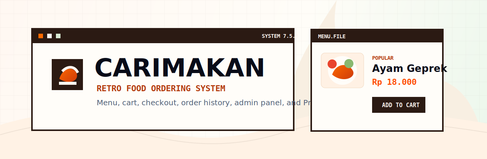
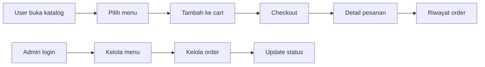

<p align="center">
  
</p>

<h1 align="center">CARIMAKAN</h1>

<p align="center">
  Web pemesanan makanan bergaya retro dengan katalog menu, keranjang, checkout, riwayat pesanan, review, favorit, dan admin panel.
</p>

<p align="center">
  <a href="https://github.com/tegokkk/CARIMAKAN">
    
  </a>
  
  
  
</p>

---

## Tentang Project

CARIMAKAN adalah aplikasi full-stack untuk pemesanan makanan. Frontend memakai React dan Vite dengan tampilan retro, sementara backend memakai Express, Prisma Client, dan MySQL/MariaDB.

Project ini cocok untuk studi kasus:

- food ordering app
- admin dashboard
- autentikasi user/admin
- REST API dengan Prisma ORM
- checkout flow end-to-end
- frontend state, error boundary, dan protected routes

## Highlight

| Area | Detail |
| --- | --- |
| Menu | Katalog makanan, pencarian, kategori, rekomendasi, detail menu |
| User | Register, login, profil, favorit, review, rating |
| Cart | Tambah menu, ubah jumlah, hapus item, clear cart |
| Checkout | Buat pesanan, detail pesanan, riwayat order |
| Admin | Dashboard, kelola menu, kategori, restoran, pesanan, user |
| Backend | Express 5, Prisma ORM, JWT, Zod, Multer, rate limit |
| UI | Tema retro, reusable components, error boundary |
| Testing | Smoke test backend untuk flow utama |

## Preview Flow



## Tech Stack

### Frontend

| Teknologi | Fungsi |
| --- | --- |
| React 19 | UI application |
| Vite | Development server dan build |
| React Router | Routing halaman |
| Axios | HTTP client |
| React Hot Toast | Feedback/toast |
| React Icons | Icon UI |
| GSAP + Lenis | Animasi dan smooth scroll |
| Tailwind CSS 4 | Styling utility |

### Backend

| Teknologi | Fungsi |
| --- | --- |
| Express 5 | REST API |
| Prisma Client | ORM database |
| MySQL/MariaDB | Database |
| JWT | Autentikasi |
| Bcrypt | Hash password |
| Zod | Validasi request |
| Multer | Upload gambar |
| Helmet/CORS/Morgan | Security, CORS, logging |

## Struktur Project

```text
CARIMAKAN/
+-- backend/
|   +-- prisma/
|   |   +-- migrations/
|   |   +-- schema.prisma
|   +-- scripts/
|   +-- src/
|   |   +-- config/
|   |   +-- controllers/
|   |   +-- middlewares/
|   |   +-- routes/
|   |   +-- services/
|   |   +-- server.js
|   +-- test-smoke.js
+-- frontend/
|   +-- public/
|   +-- src/
|   |   +-- components/
|   |   +-- context/
|   |   +-- pages/
|   |   +-- providers/
|   |   +-- services/
+-- docs/
|   +-- carimakan-banner.svg
+-- README.md
```

## Quick Start

### 1. Clone Repository

```bash
git clone https://github.com/tegokkk/CARIMAKAN.git
cd CARIMAKAN
```

### 2. Setup Database

Buat database MySQL/MariaDB:

```sql
CREATE DATABASE carimakan_db;
```

### 3. Setup Backend

```bash
cd backend
npm install
cp .env.example .env
npm run prisma:generate
npm run prisma:migrate
npm run seed
npm run seed:users
npm run dev
```

Backend berjalan di:

```text
http://localhost:5000
```

Health check:

```text
GET http://localhost:5000/api/health
```

### 4. Setup Frontend

Buka terminal baru:

```bash
cd frontend
npm install
```

Buat file `.env`:

```env
VITE_API_URL=http://localhost:5000/api
```

Jalankan frontend:

```bash
npm run dev
```

Frontend berjalan di:

```text
http://localhost:5173
```

## Environment Backend

Contoh konfigurasi ada di `backend/.env.example`.

```env
PORT=5000
NODE_ENV=development

DB_HOST=localhost
DB_USER=root
DB_PASSWORD=
DB_NAME=carimakan_db
DB_PORT=3306
DATABASE_URL="mysql://root:@localhost:3306/carimakan_db"

JWT_SECRET=carimakan_secret_key
JWT_EXPIRES_IN=7d

CLIENT_URL=http://localhost:5173
UPLOAD_PATH=uploads
```

## Akun Development

Jalankan `npm run seed:users` untuk membuat akun default:

| Role | Email | Password |
| --- | --- | --- |
| Admin | `admin@carimakan.test` | `admin123` |
| User | `user@carimakan.test` | `user123` |

Untuk production, ganti password default dan gunakan `JWT_SECRET` yang kuat.

## Script

### Backend

| Command | Fungsi |
| --- | --- |
| `npm run dev` | Menjalankan backend |
| `npm start` | Menjalankan backend |
| `npm run prisma:generate` | Generate Prisma Client |
| `npm run prisma:migrate` | Jalankan migrasi development |
| `npm run prisma:deploy` | Jalankan migrasi production |
| `npm run prisma:studio` | Buka Prisma Studio |
| `npm run seed` | Seed data menu |
| `npm run seed:users` | Seed akun admin dan user |
| `npm test` | Jalankan smoke test |

### Frontend

| Command | Fungsi |
| --- | --- |
| `npm run dev` | Menjalankan Vite dev server |
| `npm run build` | Build frontend |
| `npm run preview` | Preview hasil build |
| `npm run lint` | Jalankan ESLint |

## API Overview

Base URL:

```text
http://localhost:5000/api
```

| Modul | Endpoint |
| --- | --- |
| Auth | `/auth/register`, `/auth/login`, `/auth/me`, `/auth/logout` |
| Category | `/categories` |
| Restaurant | `/restaurants` |
| Menu | `/menus`, `/menus/:id`, `/menus/recommended`, `/menus/stats` |
| Cart | `/cart` |
| Order | `/orders`, `/orders/my`, `/orders/:id` |
| Favorite | `/favorites`, `/favorites/:menuId` |
| Review | `/menus/:menuId/reviews`, `/reviews/:id` |
| External Meal | `/external/meals/search`, `/external/meals/:id` |
| Admin | `/admin/stats`, `/admin/users`, `/admin/orders` |

Endpoint admin membutuhkan token dengan role `admin`.

## Frontend Routes

| Route | Fungsi |
| --- | --- |
| `/` | Beranda |
| `/search` | Pencarian menu |
| `/menu/:id` | Detail menu |
| `/cart` | Keranjang |
| `/checkout` | Checkout |
| `/orders` | Riwayat pesanan |
| `/orders/:id` | Detail pesanan |
| `/favorites` | Menu favorit |
| `/profile` | Profil user |
| `/admin` | Dashboard admin |
| `/admin/menus` | Kelola menu |
| `/admin/categories` | Kelola kategori |
| `/admin/restaurants` | Kelola restoran |
| `/admin/orders` | Kelola pesanan |
| `/admin/users` | Kelola user |

## Testing

Backend smoke test:

```bash
cd backend
npm test
```

Frontend production build:

```bash
cd frontend
npm run build
```

## Catatan

- File `.env`, `node_modules`, `dist`, dan upload runtime tidak masuk Git.
- Prisma schema berada di `backend/prisma/schema.prisma`.
- Migration berada di `backend/prisma/migrations`.
- Upload gambar disajikan dari endpoint `/uploads`.
- Jika data menu belum muncul, pastikan migration dan seed sudah dijalankan.
- Jika checkout gagal, pastikan user sudah login dan backend aktif.

## Deployment Ringkas

1. Set environment production untuk backend dan frontend.
2. Install dependency di `backend` dan `frontend`.
3. Jalankan `npm run prisma:deploy` di backend.
4. Build frontend dengan `npm run build`.
5. Deploy backend Node.js dan static frontend sesuai platform hosting.

---

<p align="center">
  Built as a retro food ordering system with React, Express, Prisma, and MySQL.
</p>
