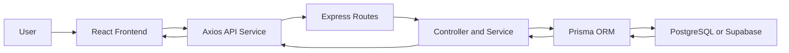
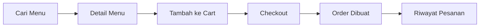

# Materi Presentasi CARIMAKAN

Tanggal presentasi: 30 Juni 2026

## 1. Pembagian Presentasi

### Pembicara 1: Kamu - Fullstack

Fokus utama:
- Menjelaskan ide aplikasi dan masalah yang diselesaikan.
- Menjelaskan fitur utama dari sisi user dan admin.
- Menjelaskan alur kerja frontend, backend, database, autentikasi, dan API.
- Menjelaskan demo teknis: login, cari menu, tambah cart, checkout, riwayat order, dan admin panel.

### Pembicara 2: Teman - Referensi UI

Fokus utama:
- Menjelaskan konsep tampilan retro food ordering.
- Menjelaskan referensi UI yang dipakai: gaya desktop retro, window/card, warna hangat, tipografi monospace, tombol pixel/tegas, dan visual makanan.
- Menjelaskan alasan desain: mudah dikenali, berbeda dari aplikasi makanan umum, dan tetap fokus ke alur pesan makanan.
- Menjelaskan pengalaman pengguna: navigasi, tampilan menu, search, cart, checkout, empty state, dan responsif.

## 2. Susunan Slide

### Slide 1 - Judul

Judul:
CARIMAKAN - Web Pemesanan Makanan Lokal

Isi slide:
- Full-stack food ordering web application.
- Dibangun menggunakan React, Express, Prisma, dan PostgreSQL/Supabase.
- Memiliki fitur customer dan admin panel.

Script:
"Selamat pagi/siang. Kami akan mempresentasikan project bernama CARIMAKAN, yaitu aplikasi web pemesanan makanan lokal. Aplikasi ini dibuat sebagai project fullstack, jadi tidak hanya menampilkan halaman frontend, tetapi juga memiliki backend, database, autentikasi, cart, checkout, riwayat pesanan, dan admin panel."

### Slide 2 - Latar Belakang

Isi slide:
- Banyak UMKM atau restoran kecil membutuhkan katalog makanan online.
- User ingin mencari makanan dengan cepat, melihat detail, lalu melakukan pemesanan.
- Admin membutuhkan panel untuk mengelola menu, kategori, restoran, user, dan pesanan.

Script:
"Latar belakang aplikasi ini adalah kebutuhan untuk membuat sistem pemesanan makanan yang sederhana, cepat, dan mudah digunakan. Dari sisi customer, mereka bisa mencari makanan, melihat detail, menambahkan ke keranjang, lalu checkout. Dari sisi admin, data menu dan pesanan bisa dikelola melalui dashboard."

### Slide 3 - Tujuan Aplikasi

Isi slide:
- Membuat platform pemesanan makanan lokal berbasis web.
- Menghubungkan customer dengan menu dari restoran atau dapur lokal.
- Menyediakan alur pemesanan dari pencarian sampai riwayat order.
- Menyediakan admin panel untuk pengelolaan data.

Script:
"Tujuan utama CARIMAKAN adalah menyediakan aplikasi pemesanan makanan lokal dengan alur yang lengkap. Jadi user tidak berhenti hanya melihat katalog, tetapi bisa login, menyimpan favorit, memasukkan makanan ke cart, checkout, dan melihat status pesanan. Admin juga bisa mengelola data utama aplikasi."

### Slide 4 - Target User

Isi slide:
- Customer: mencari menu, pesan makanan, melihat riwayat.
- Admin: mengelola menu, kategori, restoran, order, dan user.

Script:
"Di aplikasi ini ada dua jenis pengguna. Pertama customer, yang memakai aplikasi untuk mencari dan memesan makanan. Kedua admin, yang bertugas mengelola isi aplikasi seperti menu, kategori, restoran, pesanan, dan user."

### Slide 5 - Fitur Customer

Isi slide:
- Register dan login.
- Beranda dengan rekomendasi menu.
- Search dan filter kategori.
- Detail menu.
- Favorite dan review.
- Cart dan checkout.
- Riwayat pesanan.

Script:
"Untuk customer, fitur utamanya dimulai dari register dan login. Setelah itu user bisa melihat menu di beranda, mencari menu berdasarkan keyword, membuka detail makanan, menambahkan ke favorit, memberi review, menambahkan item ke cart, checkout, dan melihat riwayat pesanan."

### Slide 6 - Fitur Admin

Isi slide:
- Dashboard statistik.
- Kelola menu.
- Kelola kategori.
- Kelola restoran.
- Kelola pesanan.
- Kelola user.

Script:
"Untuk admin, aplikasi menyediakan dashboard khusus. Admin bisa melihat data ringkas, lalu melakukan pengelolaan menu, kategori, restoran, pesanan, dan user. Halaman admin dipisahkan dari halaman customer dan hanya bisa diakses oleh akun dengan role admin."

### Slide 7 - Tech Stack

Isi slide:
- Frontend: React 19, Vite, React Router, Axios.
- Styling: Tailwind CSS, custom retro components, GSAP, Lenis.
- Backend: Node.js, Express 5.
- Database: PostgreSQL/Supabase.
- ORM: Prisma.
- Auth: JWT dan Bcrypt.
- Security: Helmet, CORS, rate limit.
- Deploy: Netlify Functions dan Supabase.

Script:
"Dari sisi teknologi, frontend dibuat dengan React dan Vite. Komunikasi ke backend memakai Axios. Styling menggunakan Tailwind CSS dengan komponen custom bergaya retro, ditambah GSAP dan Lenis untuk animasi dan smooth scroll. Backend menggunakan Node.js dan Express. Database memakai PostgreSQL atau Supabase, dengan Prisma sebagai ORM. Untuk autentikasi digunakan JWT dan password diamankan menggunakan Bcrypt."

### Slide 8 - Arsitektur Sistem

Isi slide:
User membuka React frontend -> Axios request ke Express API -> Controller dan service memproses data -> Prisma mengakses PostgreSQL -> response dikirim kembali ke frontend.

Script:
"Secara arsitektur, user berinteraksi dengan frontend React. Ketika user melakukan aksi seperti login, search, tambah cart, atau checkout, frontend mengirim request ke backend melalui Axios. Backend Express menerima request lewat route, meneruskan ke controller dan service, lalu Prisma digunakan untuk membaca atau menulis data ke database PostgreSQL. Setelah itu backend mengirim response kembali ke frontend."

Diagram:

### Slide 9 - Struktur Database

Isi slide:
- User: data akun, role, profil.
- Category: kategori makanan.
- Restaurant: data restoran.
- Menu: data makanan.
- Cart: keranjang user.
- Order dan OrderItem: transaksi pemesanan.
- Favorite: menu favorit.
- Review: rating dan komentar.

Script:
"Database aplikasi dibuat dengan beberapa tabel utama. User menyimpan data akun dan role. Category dan Restaurant menjadi data pendukung untuk menu. Menu menyimpan makanan yang ditampilkan. Cart menyimpan item yang sedang dipesan user. Saat checkout, data masuk ke Order dan OrderItem. Selain itu ada Favorite dan Review untuk fitur interaksi user."

### Slide 10 - Alur Login dan Role

Isi slide:
- User register/login.
- Password disimpan dalam bentuk hash dengan Bcrypt.
- Backend membuat JWT token.
- Frontend menyimpan token di localStorage.
- Axios interceptor menambahkan token ke header Authorization.
- ProtectedRoute membatasi halaman user/admin.

Script:
"Pada proses login, password user tidak disimpan dalam bentuk teks biasa, tetapi di-hash menggunakan Bcrypt. Jika login berhasil, backend membuat JWT token. Token ini disimpan di frontend dan otomatis dikirim pada request berikutnya melalui Authorization header. Di frontend juga ada ProtectedRoute untuk membatasi halaman tertentu, misalnya admin hanya bisa masuk jika role-nya admin."

### Slide 11 - Alur Pemesanan

Isi slide:
Cari menu -> Detail menu -> Tambah ke cart -> Checkout -> Order dibuat -> Riwayat pesanan.

Script:
"Alur utama aplikasi adalah pemesanan makanan. User mencari menu, membuka detail, lalu menambahkan ke cart. Setelah jumlah item sesuai, user masuk ke checkout dan mengisi data pengiriman. Backend akan membuat order beserta order item, menghitung total harga, lalu user bisa melihat riwayat pesanan."

Diagram:

### Slide 12 - API Utama

Isi slide:
- Auth: /auth/register, /auth/login, /auth/me.
- Menu: /menus, /menus/:id, /menus/recommended, /menus/stats.
- Cart: /cart.
- Order: /orders, /orders/my, /orders/:id.
- Favorite: /favorites.
- Review: /menus/:menuId/reviews.
- Admin: /admin/stats, /admin/users, /admin/orders.

Script:
"Backend menyediakan API sesuai modul. Modul auth menangani login dan register. Modul menu menangani katalog dan detail makanan. Modul cart dan order menangani proses pemesanan. Favorite dan review digunakan untuk fitur tambahan user. Endpoint admin digunakan untuk dashboard dan pengelolaan data, dan endpoint ini membutuhkan token admin."

### Slide 13 - UI Concept oleh Teman

Isi slide:
- Konsep: retro food discovery.
- Visual seperti aplikasi desktop klasik.
- Menggunakan window, titlebar, border tebal, shadow pixel, dan tombol tegas.
- Warna utama: warm background, coklat gelap, orange, dan biru sebagai aksen.
- Font: JetBrains Mono, Space Mono, Space Grotesk.

Script untuk teman:
"Konsep UI yang kami gunakan adalah retro food discovery, yaitu tampilan aplikasi makanan dengan nuansa desktop klasik. Karena banyak aplikasi makanan modern memakai tampilan yang mirip, kami ingin CARIMAKAN punya identitas visual yang berbeda. Elemen seperti window, titlebar, border tebal, shadow pixel, dan tombol bergaya retro dipakai agar aplikasi terlihat unik tetapi tetap mudah digunakan."

### Slide 14 - Referensi dan Alasan Desain

Isi slide:
- Referensi dari tampilan retro operating system dan katalog makanan modern.
- Kartu menu dibuat seperti file/card makanan.
- Foto makanan tetap menjadi fokus utama.
- Tombol dibuat jelas untuk aksi penting seperti search, add to cart, dan checkout.
- Layout dibuat responsif untuk desktop dan mobile.

Script untuk teman:
"Referensi UI-nya menggabungkan gaya retro operating system dengan kebutuhan aplikasi makanan modern. Kartu menu dibuat seperti file makanan agar sesuai tema, tetapi foto makanan tetap menjadi fokus utama karena user perlu melihat produknya. Tombol dibuat kontras untuk aksi penting seperti cari menu, tambah ke keranjang, dan checkout. Layout juga dibuat responsif agar tetap nyaman di desktop maupun mobile."

### Slide 15 - Demo Aplikasi

Urutan demo:
1. Buka halaman beranda.
2. Tunjukkan search menu.
3. Buka detail menu.
4. Login sebagai user.
5. Tambah menu ke cart.
6. Checkout.
7. Lihat riwayat pesanan.
8. Login sebagai admin.
9. Tunjukkan dashboard dan kelola menu/order.

Script:
"Pada demo, kami akan menunjukkan alur dari sisi customer terlebih dahulu. Mulai dari beranda, mencari menu, membuka detail, login, menambahkan ke cart, checkout, sampai melihat riwayat pesanan. Setelah itu kami tunjukkan sisi admin, yaitu dashboard dan pengelolaan data."

### Slide 16 - Testing dan Deployment

Isi slide:
- Backend memiliki smoke test.
- Frontend dapat diuji dengan lint dan build.
- Deployment disiapkan untuk Netlify.
- Database production dapat memakai Supabase.

Script:
"Untuk memastikan aplikasi berjalan, backend memiliki smoke test. Frontend bisa dicek dengan lint dan build. Dari sisi deployment, project sudah disiapkan agar frontend Vite dan backend Express dapat berjalan di Netlify, sedangkan database dapat menggunakan Supabase."

### Slide 17 - Kelebihan Aplikasi

Isi slide:
- Fullstack lengkap: frontend, backend, database, auth, admin.
- Alur customer jelas dari cari menu sampai checkout.
- Role admin dan user terpisah.
- UI memiliki identitas visual retro.
- Struktur project modular.

Script:
"Kelebihan dari aplikasi ini adalah cakupannya cukup lengkap sebagai project fullstack. Ada frontend, backend, database, autentikasi, role user dan admin, serta proses transaksi sederhana. Selain itu UI memiliki identitas visual retro sehingga aplikasi lebih mudah diingat."

### Slide 18 - Kekurangan dan Pengembangan

Isi slide:
- Payment gateway belum real.
- Tracking pengiriman belum tersedia.
- Upload gambar di Netlify belum permanen.
- Bisa dikembangkan dengan Supabase Storage, notifikasi, voucher, dan real-time order status.

Script:
"Aplikasi ini masih bisa dikembangkan. Saat ini payment masih berupa simulasi atau COD, belum payment gateway real. Tracking pengiriman juga belum tersedia. Untuk production, upload gambar sebaiknya dipindahkan ke storage permanen seperti Supabase Storage. Ke depannya bisa ditambahkan notifikasi, voucher, dan status order real-time."

### Slide 19 - Kesimpulan

Isi slide:
- CARIMAKAN adalah aplikasi pemesanan makanan lokal berbasis web.
- Aplikasi memiliki fitur customer dan admin.
- Dibangun dengan arsitektur fullstack modern.
- UI retro memberi karakter visual yang berbeda.

Script:
"Kesimpulannya, CARIMAKAN adalah aplikasi pemesanan makanan lokal berbasis web dengan fitur customer dan admin. Aplikasi ini dibangun menggunakan arsitektur fullstack modern, mulai dari React di frontend, Express di backend, Prisma sebagai ORM, dan PostgreSQL sebagai database. Dari sisi tampilan, konsep retro dipilih agar aplikasi punya karakter visual yang kuat dan berbeda."

## 3. Pembagian Waktu Presentasi

Jika waktu presentasi 10 menit:
- Pembukaan dan latar belakang: 1 menit.
- Penjelasan fitur dan tech stack oleh kamu: 3 menit.
- Penjelasan UI dan referensi oleh teman: 2 menit.
- Demo aplikasi oleh kamu: 3 menit.
- Kesimpulan: 1 menit.

Jika waktu presentasi 15 menit:
- Pembukaan dan latar belakang: 2 menit.
- Fitur customer dan admin: 3 menit.
- Arsitektur fullstack dan database: 4 menit.
- UI reference dan desain: 3 menit.
- Demo dan penutup: 3 menit.

## 4. Script Pembukaan Singkat

"Selamat pagi/siang. Kami akan mempresentasikan project CARIMAKAN, yaitu aplikasi web pemesanan makanan lokal. Project ini dibuat sebagai aplikasi fullstack, sehingga mencakup frontend, backend, database, autentikasi, fitur pemesanan, dan admin panel. Saya akan menjelaskan bagian fullstack dan alur sistemnya, sedangkan teman saya akan menjelaskan bagian referensi UI dan konsep desain yang digunakan."

## 5. Script Pembagian Tugas

"Dalam project ini, pembagian kerja kami adalah saya fokus pada bagian fullstack, yaitu implementasi frontend, backend, API, database, autentikasi, dan integrasi fitur. Teman saya fokus pada pencarian referensi UI, arah visual, serta bagaimana tampilan aplikasi dibuat agar sesuai dengan konsep retro food ordering."

## 6. Penjelasan Fullstack yang Bisa Kamu Hafalkan

"Dari sisi frontend, aplikasi menggunakan React dengan Vite. Halaman dibagi menjadi halaman publik, halaman user, dan halaman admin. Untuk routing kami menggunakan React Router. Untuk komunikasi dengan backend, frontend memakai Axios. Token login disimpan dan dikirim otomatis melalui interceptor, sehingga endpoint yang membutuhkan autentikasi dapat diakses setelah user login.

Dari sisi backend, aplikasi menggunakan Express. Setiap fitur dipisahkan menjadi route, controller, dan service agar struktur kode lebih rapi. Backend juga memakai middleware untuk autentikasi, role admin, validasi, upload, error handling, CORS, dan security header. Database menggunakan PostgreSQL dengan Prisma ORM, sehingga model seperti User, Menu, Cart, Order, Favorite, dan Review dapat dikelola secara lebih terstruktur.

Alur data sederhananya adalah user melakukan aksi di frontend, frontend mengirim request ke API, backend memproses request, Prisma membaca atau menulis data ke database, lalu hasilnya dikirim kembali ke frontend untuk ditampilkan."

## 7. Penjelasan UI yang Bisa Teman Kamu Hafalkan

"Untuk UI, konsep yang dipilih adalah retro food discovery. Kami mengambil inspirasi dari tampilan operating system lama, seperti window, titlebar, border tebal, shadow pixel, dan tombol yang terlihat tegas. Konsep ini digabungkan dengan kebutuhan aplikasi makanan modern, seperti foto makanan yang jelas, kartu menu yang mudah dibaca, tombol add to cart yang menonjol, serta layout yang responsif.

Warna yang dipakai cenderung hangat karena sesuai dengan tema makanan, seperti background warm, coklat gelap untuk teks, orange untuk aksi utama, dan biru sebagai aksen. Font monospace dan headline retro dipilih untuk memperkuat identitas visual. Tujuannya bukan hanya agar aplikasi terlihat unik, tetapi juga agar user tetap mudah memahami alur pemesanan."

## 8. Jawaban Cepat Jika Ditanya

### Kenapa memakai React?

"Karena React memudahkan pembuatan UI berbasis komponen. Komponen seperti FoodCard, Header, ProtectedRoute, dan form admin bisa digunakan ulang sehingga pengembangan lebih rapi."

### Kenapa memakai Express?

"Karena Express ringan dan fleksibel untuk membuat REST API. Struktur route, controller, service, dan middleware juga mudah dipahami untuk project fullstack."

### Kenapa memakai Prisma?

"Prisma membantu menghubungkan backend dengan database menggunakan model yang jelas. Query database menjadi lebih terstruktur dan schema database lebih mudah dikelola."

### Bagaimana keamanan login?

"Password di-hash menggunakan Bcrypt. Setelah login berhasil, backend memberi JWT token. Token dipakai untuk mengakses endpoint yang membutuhkan autentikasi."

### Bagaimana membedakan user dan admin?

"Di database User ada field role. Route admin dilindungi oleh middleware role, sedangkan di frontend halaman admin dilindungi dengan ProtectedRoute khusus role admin."

### Bagaimana proses checkout?

"User menambahkan item ke cart. Saat checkout, backend mengambil item cart, menghitung subtotal dan total harga, membuat data order dan order item, lalu cart bisa dikosongkan setelah order berhasil."

### Apa keunikan aplikasi ini?

"Keunikannya adalah aplikasi ini tidak hanya katalog makanan, tetapi memiliki alur pemesanan lengkap dan admin panel. Selain itu tampilannya memakai konsep retro yang memberi identitas visual berbeda."

### Apa kekurangan saat ini?

"Payment gateway belum real, tracking pengiriman belum tersedia, dan upload gambar untuk production perlu dipindahkan ke storage permanen seperti Supabase Storage."

## 9. Checklist Sebelum Presentasi

- Jalankan backend: `cd backend` lalu `npm run dev`.
- Jalankan frontend: `cd frontend` lalu `npm run dev`.
- Pastikan `.env` frontend berisi `VITE_API_URL=http://localhost:5000/api`.
- Pastikan database sudah migration dan seed.
- Siapkan akun demo:
  - Admin: `admin@carimakan.test` / `admin123`
  - User: `user@carimakan.test` / `user123`
- Latih demo tanpa terlalu lama di satu halaman.
- Siapkan jawaban jika internet atau database bermasalah: jelaskan dari README, schema, dan screenshot/demo lokal.

## 10. Kalimat Penutup

"Demikian presentasi project CARIMAKAN dari kami. Aplikasi ini menunjukkan implementasi fullstack dari frontend, backend, database, autentikasi, pemesanan, dan admin panel. Dengan konsep UI retro, kami mencoba membuat aplikasi pemesanan makanan yang tidak hanya fungsional, tetapi juga punya identitas visual yang mudah diingat. Terima kasih."
